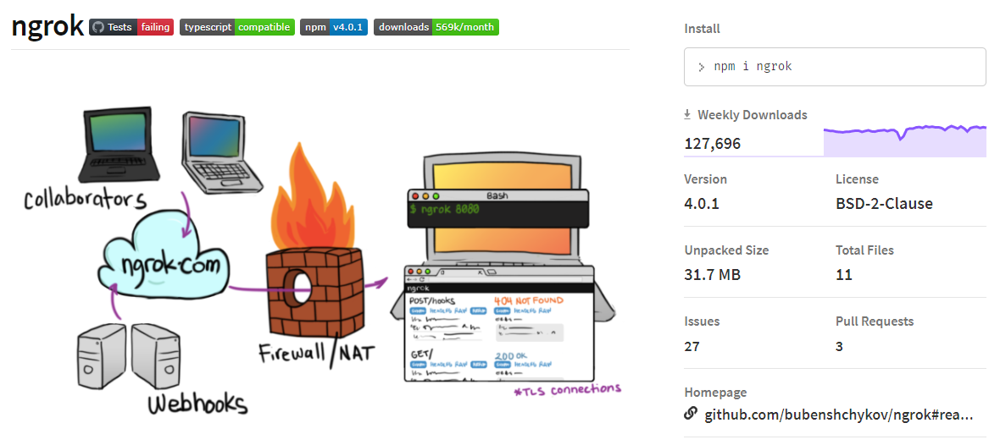
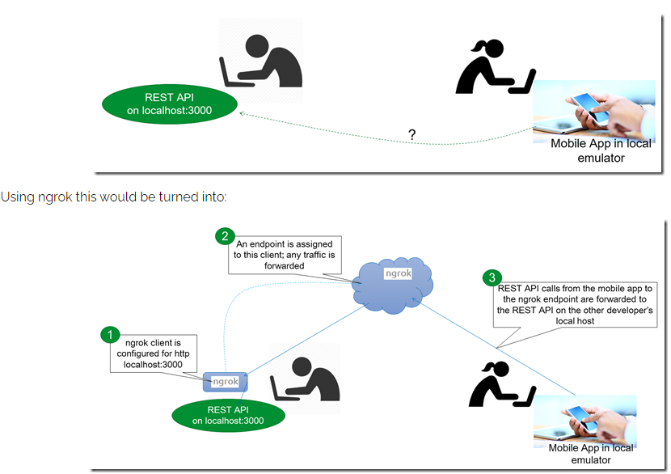
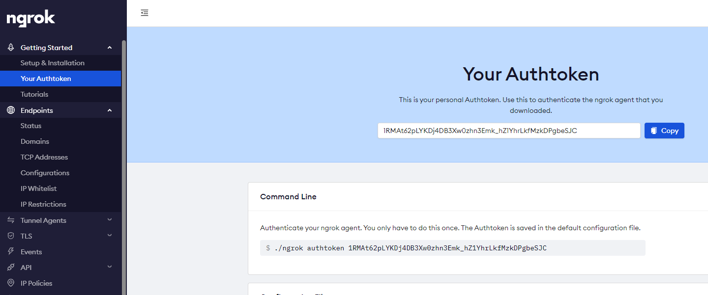
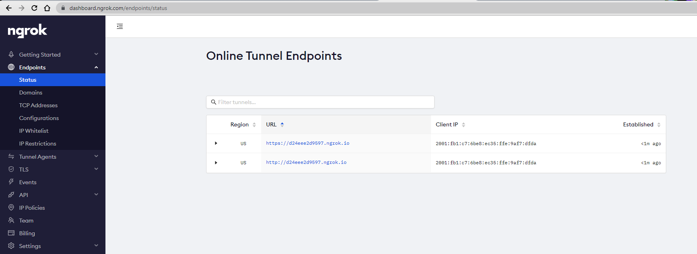

# ngrok 
https://www.npmjs.com/package/ngrok




Global install
```bash
npm install ngrok -g
#ngrok http <port>
ngrok http 8080
```

# dashboard.ngrok
In browser goto https://dashboard.ngrok.com/

Get your token, open the menu 'Getting Started > Your Authtoken'
This is your personal Authtoken. Use this to authenticate the ngrok agent that you.



Authenticate your ngrok agent.
```bash
ngrok authtoken 1RMAt62pLYKDj4DB3Xw0zhn3Emk_hZ1YhrLkfMzkDPgbeSJC
ngrok http 8080
```

Open the menu 'Endpoints > Status'



